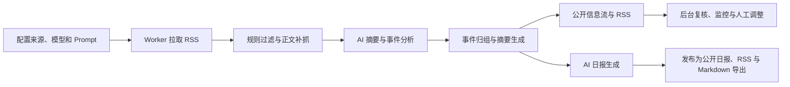

## Infinitum 是什么？

Infinitum 是自托管的资讯聚合工作台，用来完成 RSS 抓取、正文补抓、AI 摘要分析、事件归组、AI 日报生成等信息处理。目标是对日益膨胀的个人信息流进行必要但保守的预处理，提高信息获取效率。


## 核心功能

- **多源 RSS 同步与正文补全**：支持多源订阅、源级并发控制、每源处理上限；当 RSS 自带内容不足时，会按阈值自动抓取正文。


- **信息源与分组管理**：支持新增、编辑、删除信息源，自动解析 RSS 元数据；按分组筛选与排序，并支持 OPML 导入/导出。


- **源级处理开关**：每个信息源可独立控制启用状态、AI 解析、是否参与聚合与聚合检测。高噪声源可以继续保留在抓取范围内，但仅入库不参与后续聚合。


- **规则过滤与复核**：抓取阶段按黑名单、低信号标题、低信号 URL、正文质量等规则打分；被过滤的内容进入后台复核列表，可手动恢复、过滤或重新处理。


- **AI 摘要与分析**：支持标题翻译、摘要生成、内容质量判断、事件结构化分析；不同类型的 Prompt 可绑定不同的模型 API 配置。


- **事件归组**：把描述同一事件的多条内容合并为 cluster，先用事件签名做快速匹配，再交由 AI 判定；减少信息流中的重复噪声。


- **信息流浏览**：按系统收录时间、原文发布时间、来源、分组、标题关键词筛选；按时间或推荐评分排序；聚合内容与单条内容混合展示。


- **AI 日报**：基于当天候选内容生成结构化日报，支持草稿与发布状态切换、公开页面与 RSS 订阅、以及 Markdown 导出。


- **后台任务与观测**：Web 负责入队，Worker 负责异步执行；任务支持定时调度、监控、取消、重试、阶段耗时、AI 调用拆分、进度标签、任务时间线和最近运行记录。


## 使用流程



### RSS 阅读

Android 手机端 RSS 阅读可使用 [readrops-lumina](https://github.com/shawnxie94/readrops-lumina)，[安装包](https://github.com/shawnxie94/readrops-lumina/releases)，支持快速采集内容到 [Lumina](https://github.com/shawnxie94/lumina)。


## 快速开始

### Docker 部署

```bash
cp docker-compose.yml.example docker-compose.yml
docker compose pull
docker compose up -d
```

在 `docker-compose.yml` 中至少替换以下值：

- `ADMIN_PASSWORD`：管理员登录密码
- `ADMIN_SESSION_SECRET`：Session 签名密钥
- `SITE_URL`：生产环境建议设置为实际访问域名，用于 RSS 中的站点与订阅链接

启动后访问：

- Web：<http://localhost:3001>
- 管理员登录：<http://localhost:3001/login>
- 管理后台：<http://localhost:3001/admin>
- AI 日报：<http://localhost:3001/daily>

### 本地开发

```bash
npm install
cp .env.example .env
npm run prisma:generate
npm run db:setup

npm run dev      # 终端 1：Next.js 开发服务
npm run worker   # 终端 2：后台任务 Worker
```

本地默认访问 <http://localhost:3000>，管理后台登录入口 <http://localhost:3000/login>。

## FAQ

### 为什么改了源码里的默认来源或提示词，线上没有变化？

默认配置只在初始化阶段导入一次。系统启动并写入数据库后，运行以数据库中的配置为准，请通过后台设置页修改。

### 为什么手动触发抓取后没有执行？

Web 只负责创建任务，真正执行抓取、AI 分析、归组和日报的是 Worker。请先确认 `worker` 服务在运行。

```bash
docker compose ps
docker compose logs -f worker
```

### 为什么 Docker 启动后访问不了 `localhost:3000`？

默认 Compose 端口映射是 `3001:3000`，宿主机应该访问 <http://localhost:3001>。

### 为什么后台可以打开，但信息流一直没有更新？

通常有几类原因：

- 没有可用的信息源配置
- Worker 未运行或持续异常退出
- 抓取调度未开启，且没有手动触发抓取
- 模型 API 未配置，导致 AI 能力回退，但基础抓取不受影响
- 来源内容没有变化，系统根据 RSS 缓存信息和内容哈希跳过了重复处理

建议先查看：

```bash
docker compose logs -f app worker
```

### 为什么日报没有生成？

常见原因包括：当天候选内容不足、模型 API 未配置、模型返回未通过结构化校验、输入未变化时任务被跳过。可在任务监控页查看 `AI 日报生成` 任务的状态、错误信息和 AI 调用统计。

## 友链

[linux.do](https://linux.do/)

## 许可证

MIT
