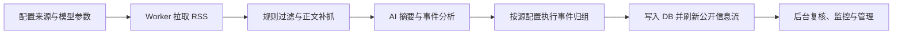

## Infinitum 是什么？
Infinitum 是基于 RSS 的资讯聚合工作台，用来完成 RSS 抓取、正文补抓、AI 摘要分析、事件归组等信息处理。目标是对日益膨胀的个人信息流进行必要但保守的预处理，提高信息获取效率。


## 核心功能
- **RSS 抓取与正文补全**：支持多源 RSS 同步、源级并发控制、每源处理上限，并在 RSS 内容不足时按阈值自动补抓正文。


- **源管理与分组**：支持新增、编辑、删除信息源，自动解析 RSS 元数据，按分组筛选与拖拽排序，并支持 OPML 导入/导出。
- **源级处理开关**：每个信息源可独立控制启用状态、AI 解析和是否参与聚合，便于保留高噪声源但避免其干扰事件归组。


- **规则过滤与黑名单**：抓取阶段会先执行黑名单、低信号标题、低信号 URL、正文质量等规则评分，命中的内容进入过滤列表等待复核。


- **AI 摘要与分析**：支持标题翻译、摘要生成、内容质量判断、事件结构化分析，并可为不同 Prompt 绑定不同模型 API 配置。


- **事件归组**：将描述同一事件的多条内容聚合为 cluster，支持基于事件签名的快速匹配和 AI 匹配，减少信息流重复噪声。


- **公开信息流浏览**：支持按系统收录时间、原文发表时间、来源、分组、标题关键词筛选，支持按时间或推荐评分排序，并混合展示聚合内容与单条内容。
- **访客互动能力**：支持对聚合内容和单条内容投票，并输出公开 RSS。


- **管理员工作台**：支持手动触发抓取、查看任务状态、过滤/恢复内容、重跑 AI、调整聚合关系、隐藏、恢复或合并聚合组。
- **后台任务体系**：Web 负责入队，Worker 负责异步执行，支持调度、监控、取消、重试、异常恢复和任务时间线。


## 使用流程



## 快速开始

### 1. 配置 Compose

将 `docker-compose.yml.example` 复制为 `docker-compose.yml`，至少替换以下值：
- `ADMIN_PASSWORD`
- `ADMIN_SESSION_SECRET`

如通过 HTTP 在可信内网访问，可将 `ADMIN_SESSION_COOKIE_SECURE` 改为 `"false"`。

### 2. 启动服务

使用已发布镜像部署：

```bash
docker compose pull
docker compose up -d
```

### 3. 验证状态

```bash
docker compose ps
docker compose logs -f app worker
```

默认访问地址：

- Web：<http://localhost:3001>
- 管理员登录：<http://localhost:3001/login>

## 本地开发

### 1. 安装依赖

```bash
npm install
```

### 2. 准备环境变量

```bash
cp .env.example .env
```

默认本地环境变量：

```env
DATABASE_URL="file:./prisma/dev.db"
ADMIN_PASSWORD="change-me"
ADMIN_SESSION_SECRET="replace-with-a-long-random-secret"
```

### 3. 初始化数据库

```bash
npm run prisma:generate
npm run db:setup
```

### 4. 启动 Web 和 Worker

```bash
# 终端 1
npm run dev

# 终端 2
npm run worker
```

本地默认访问地址：

- Web：<http://localhost:3000>
- 管理后台登录：<http://localhost:3000/login>

## 运行配置

首次启动会初始化，后续通过后台设置页维护：

- **信息源**：RSS URL、站点 URL、所属分组、启用状态、AI 解析开关、参与聚合开关，支持 OPML 批量导入和导出。
- **来源分组**：创建、重命名、删除和拖拽排序，用于公开信息流筛选和后台管理。
- **黑名单关键词**：命中后会在规则过滤阶段进入过滤列表。
- **模型 API 配置**：支持 OpenAI 兼容接口、模型名、API Key、条目级 AI 并发和默认模型选择。
- **Prompt 配置**：支持条目摘要、条目分析、聚合摘要、聚合匹配等 Prompt 类型。
- **抓取调度参数**：默认抓取任务开关、Cron 表达式、源抓取并发、正文补抓阈值、每源处理上限和处理开始时间点。

默认模型配置为空时：

- 标题翻译会回退为原标题
- 摘要会回退为 RSS 摘要或正文截断
- 内容分析会回退为基础默认值
- 事件归组会尽量使用已有结构化信息，无法判断时按单条内容展示

## FAQ

### 为什么我改了源码里的默认来源或提示词，线上没有变化？

因为这些默认值只在初始化阶段导入一次。系统启动并写入数据库后，后续运行以数据库中的配置为准，应通过后台设置页修改。

### 为什么手动触发抓取后没有执行？

先检查 `worker` 服务是否在运行：

```bash
docker compose ps
docker compose logs -f worker
```

Web 只负责创建任务，真正执行抓取、AI 分析和归组的是 Worker。

### 为什么调用 `/api/ingest/run` 返回 401？

这个接口要求管理员登录态。请先访问 `/login` 登录，再从页面操作或携带管理员会话调用接口。

### 为什么 Docker 启动后访问不了 `localhost:3000`？

因为默认 Compose 端口映射是 `3001:3000`，宿主机应该访问 <http://localhost:3001>。

### 为什么后台可以打开，但信息流一直没有更新？

通常有三类原因：

- 没有可用的信息源配置
- Worker 未运行或持续异常退出
- 模型 API 未配置，导致 AI 能力回退，但这一般不会阻止基础抓取

建议先检查：

```bash
docker compose logs -f app worker
```

## 许可证

CC BY 4.0 License
