## Infinitum 是什么？
Infinitum 是基于 RSS 的资讯聚合工作台，用来完成 RSS 抓取、正文补抓、AI 摘要分析、事件归组、AI 日报生成等信息处理。目标是对日益膨胀的个人信息流进行必要但保守的预处理，提高信息获取效率。

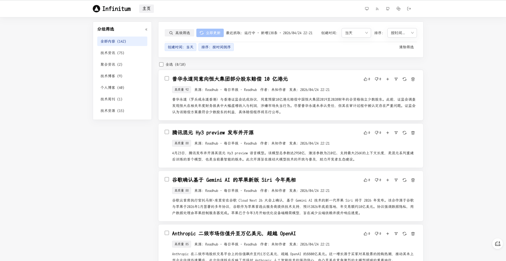

## 核心功能
- **RSS 抓取与正文补全**：支持多源 RSS 同步、源级并发控制、每源处理上限，并在 RSS 内容不足时按阈值自动补抓正文。

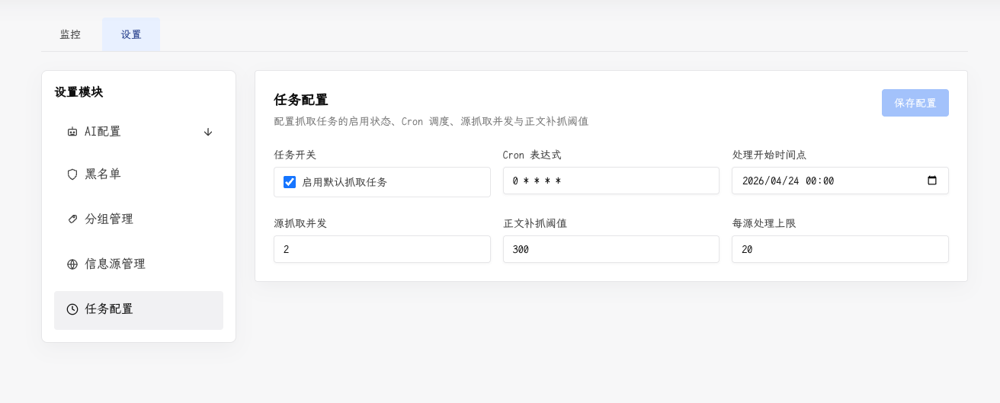

- **信息源与分组管理**：支持新增、编辑、删除信息源，自动解析 RSS 元数据，按来源分组筛选与排序，并支持 OPML 导入/导出。

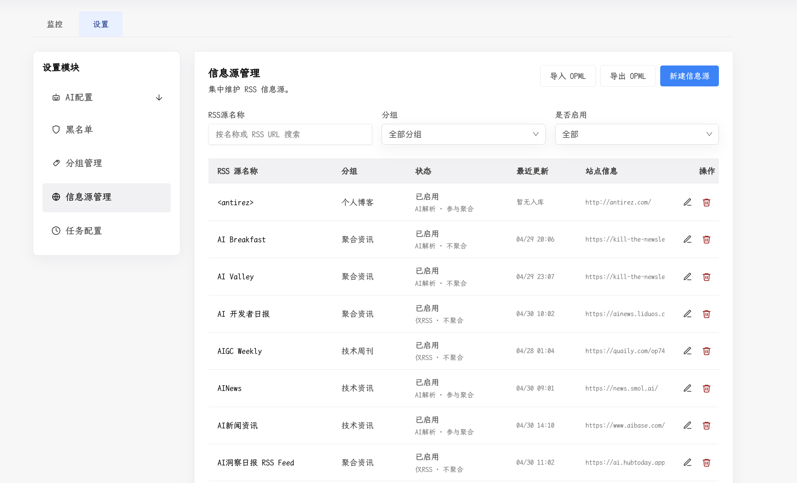

- **源级处理开关**：每个信息源可独立控制启用状态、AI 解析和是否参与聚合。高噪声源可以继续保留在抓取范围内，但不参与事件归组。

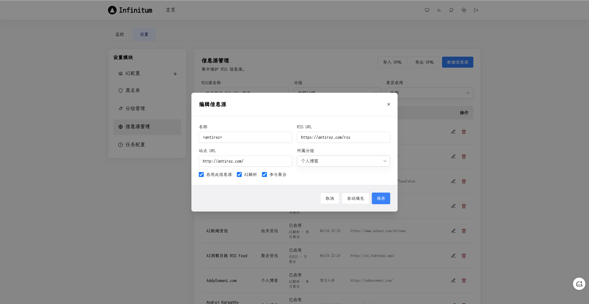

- **规则过滤与复核**：抓取阶段先执行黑名单、低信号标题、低信号 URL、正文质量等规则判断。被过滤内容进入后台复核列表，可手动恢复、过滤或重新处理。

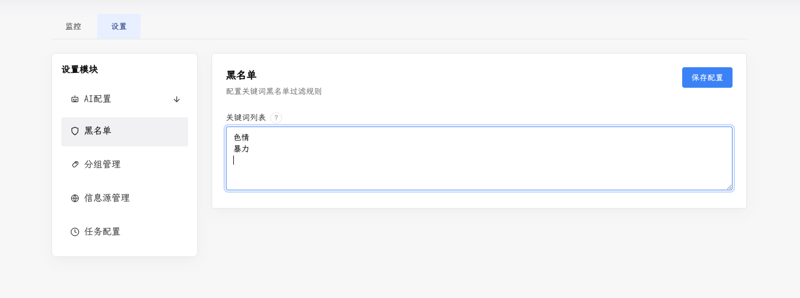

- **AI 摘要与分析**：支持标题翻译、摘要生成、内容质量判断、事件结构化分析，并可为不同 Prompt 绑定不同模型 API 配置。

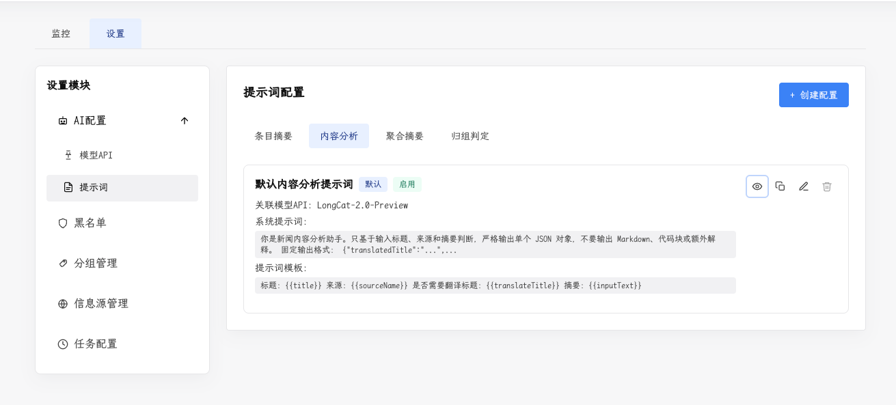

- **事件归组**：将描述同一事件的多条内容聚合为 cluster，支持基于事件签名的快速匹配和 AI 匹配，减少信息流重复噪声。

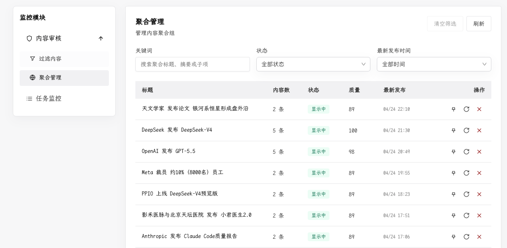

- **公开信息流浏览互动**：支持按系统收录时间、原文发布时间、来源、分组、标题关键词筛选，支持按时间或推荐评分排序，并混合展示聚合内容与单条内容。支持对聚合内容和单条内容投票，并输出公开 RSS。

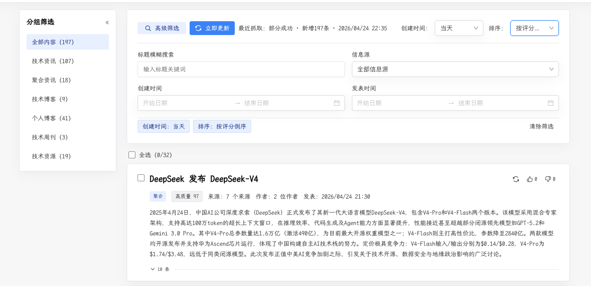

- **AI 日报生成与微调**：支持基于当天候选内容生成结构化 AI 日报，针对不满意的部分可通过 AI 微调进行调整。

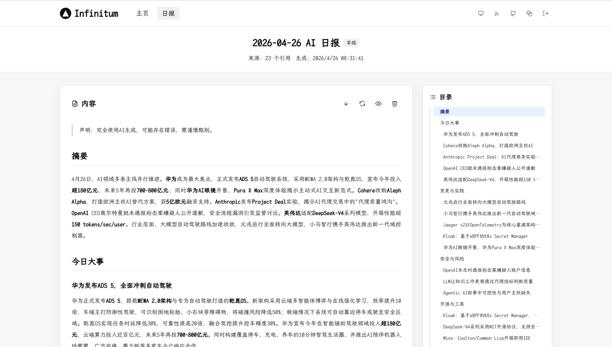

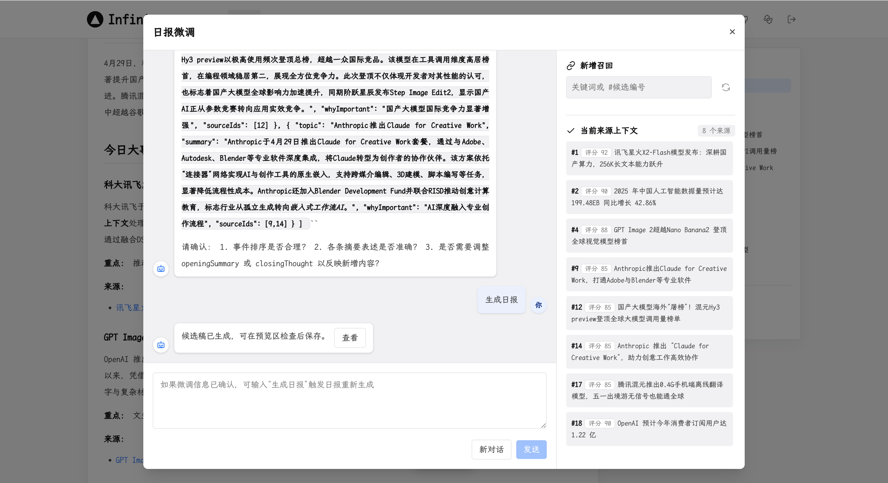

- **后台任务体系与观测**：Web 负责入队，Worker 负责异步执行。任务支持定时调度、监控、取消、重试、异常恢复、阶段耗时、AI 调用拆分、进度标签、任务时间线和最近运行记录。

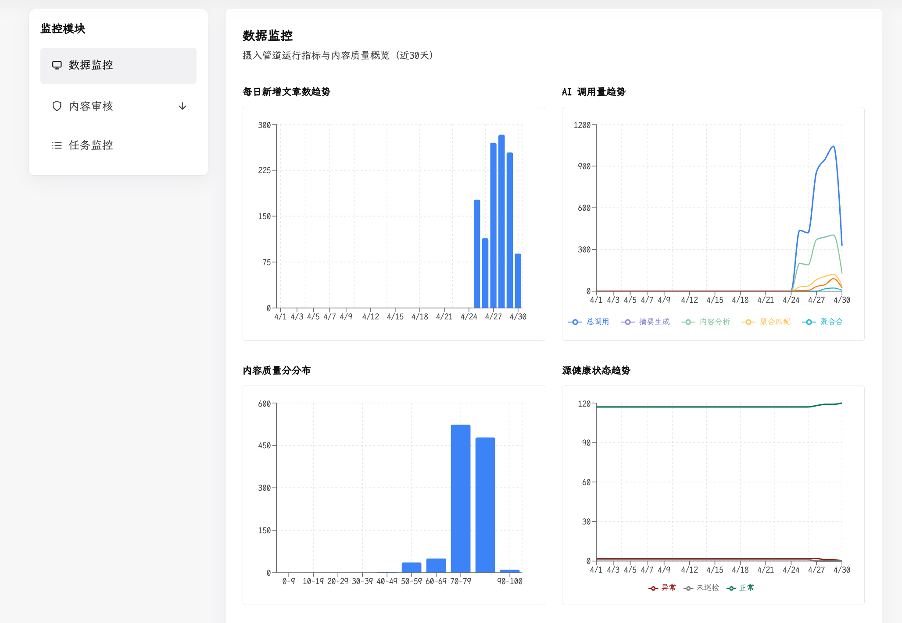

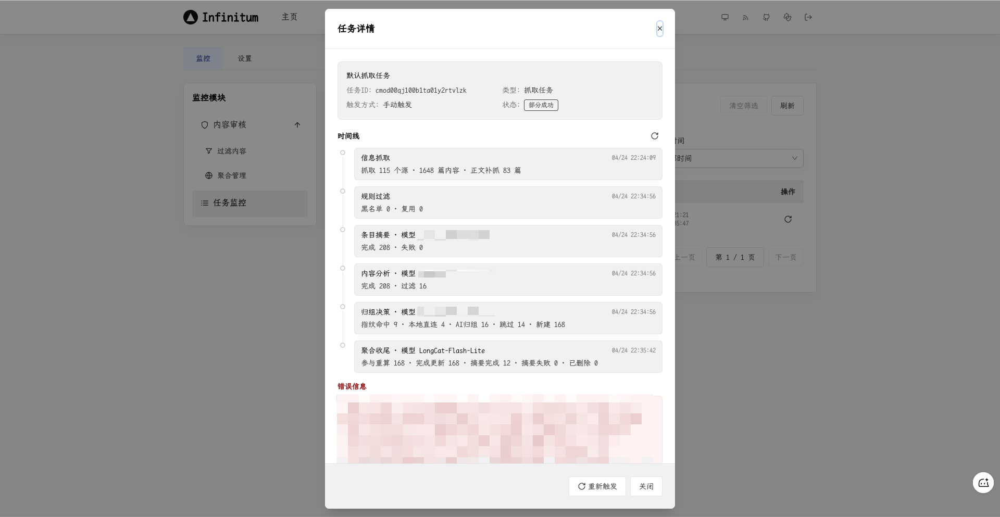

## 使用流程

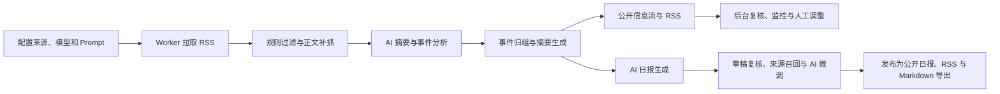

### RSS 阅读

Android 手机端 RSS 阅读可使用 [readrops-lumina](https://github.com/shawnxie94/readrops-lumina), [安装包](https://github.com/shawnxie94/readrops-lumina/releases)，支持快速采集内容到 [Lumina](https://github.com/shawnxie94/lumina)。

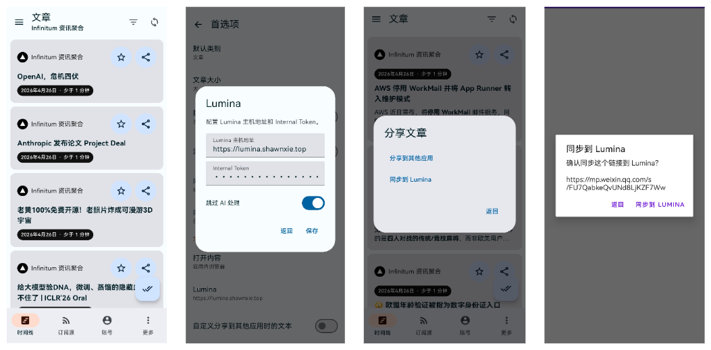

## 快速开始

### 1. 配置 Compose

使用已发布镜像部署时，复制 Compose 示例：

```bash
cp docker-compose.yml.example docker-compose.yml
```

然后在 `docker-compose.yml` 中至少替换以下值：

- `ADMIN_PASSWORD`
- `ADMIN_SESSION_SECRET`
- `SITE_URL`：生产环境建议设置为实际访问域名，例如 `https://your-domain.example`，用于 RSS XML 中的站点与订阅链接

worker 任务完成后会默认通过 `http://app:3000` 主动预热首页和 feed 接口缓存。如果调整了 Compose 服务名或端口，可用 `FEED_CACHE_WARM_URL` 覆盖；如果配置了代理，建议在 `NO_PROXY` 中包含 `app`。

如通过 HTTP 在可信内网访问，可将 `ADMIN_SESSION_COOKIE_SECURE` 改为 `"false"`。

### 2. 启动服务

使用已发布镜像部署：

```bash
docker compose pull
docker compose up -d
```

### 3. 验证状态

```bash
docker compose ps
docker compose logs -f app worker
```

默认访问地址：

- Web：<http://localhost:3001>
- 管理员登录：<http://localhost:3001/login>
- 管理后台：<http://localhost:3001/admin>
- 内容管理：<http://localhost:3001/admin/content>
- 系统设置：<http://localhost:3001/admin/settings>
- 任务监控：<http://localhost:3001/admin/monitor>
- AI 日报：<http://localhost:3001/daily>

## 本地开发

### 1. 安装依赖

```bash
npm install
```

### 2. 准备环境变量

```bash
cp .env.example .env
```

默认本地环境变量：

```env
DATABASE_URL="file:./prisma/dev.db"
ADMIN_PASSWORD="change-me"
ADMIN_SESSION_SECRET="replace-with-a-long-random-secret"
# SITE_URL="https://your-domain.example"
# Optional cache warm origin override. Docker compose defaults to http://app:3000.
# FEED_CACHE_WARM_URL="http://localhost:3000"
```

### 3. 初始化数据库

```bash
npm run prisma:generate
npm run db:setup
```

### 4. 启动 Web 和 Worker

```bash
# 终端 1
npm run dev

# 终端 2
npm run worker
```

本地默认访问地址：

- Web：<http://localhost:3000>
- 管理后台登录：<http://localhost:3000/login>

## 常用命令

```bash
npm run dev              # 启动 Next.js 开发服务
npm run worker           # 启动后台 Worker
npm run build            # 生产构建
npm run build:worker     # 构建 Worker 入口
npm run lint             # ESLint 检查
npm test                 # 运行测试并生成覆盖率
npm run db:setup         # 初始化或升级本地 SQLite 数据库
npm run db:test:setup    # 重置并初始化测试数据库
npm run prisma:generate  # 生成 Prisma Client
npm run prisma:migrate   # 执行 Prisma 开发迁移
```

## 运行配置

首次启动会初始化，后续通过后台设置页维护：

- **信息源**：RSS URL、站点 URL、所属分组、启用状态、AI 解析开关、参与聚合开关，支持 OPML 批量导入。
- **来源分组**：创建、重命名、删除和排序，用于公开信息流筛选和后台管理。
- **黑名单关键词**：命中后会在规则过滤阶段进入过滤列表。
- **模型 API 配置**：支持 OpenAI 兼容接口、模型名、API Key、条目级 AI 并发、启用状态和默认模型选择。
- **Prompt 配置**：支持条目摘要、条目分析、聚合摘要、聚合匹配、日报生成、日报微调对话、日报微调生成等 Prompt 类型，并可单独设置温度、Token 上限、Top P 和模型配置。
- **抓取调度**：默认抓取任务开关、Cron 表达式、源抓取并发、正文补抓阈值、每源处理上限和处理开始时间点。
- **日报调度**：AI 日报生成开关、Cron 表达式、候选内容数量、偏移天数、失败重试次数、自动发布开关和最近运行状态。
- **清理调度**：文章自动清理开关、Cron 表达式和保留天数，用于控制长期运行时的数据体量。

默认模型配置为空时：

- 标题翻译会回退为原标题
- 摘要会回退为 RSS 摘要或正文截断
- 内容分析会回退为基础默认值
- 事件归组会尽量使用已有结构化信息，无法判断时按单条内容展示
- AI 日报需要可用模型配置；候选内容不足或模型无输出时不会生成有效日报
- AI 日报微调需要可用模型配置；已发布日报需要先撤回为草稿后才能保存微调候选稿

## FAQ

### 为什么我改了源码里的默认来源或提示词，线上没有变化？

因为默认值只在初始化阶段导入一次。系统启动并写入数据库后，后续运行以数据库中的配置为准，应通过后台设置页修改。

### 为什么手动触发抓取后没有执行？

先检查 `worker` 服务是否在运行：

```bash
docker compose ps
docker compose logs -f worker
```

Web 只负责创建任务，真正执行抓取、AI 分析、归组和日报生成的是 Worker。

### 为什么调用 `/api/ingest/run` 返回 401？

这个接口要求管理员登录态。请先访问 `/login` 登录，再从页面操作或携带管理员会话调用接口。

### 为什么 Docker 启动后访问不了 `localhost:3000`？

因为默认 Compose 端口映射是 `3001:3000`，宿主机应该访问 <http://localhost:3001>。

### 为什么后台可以打开，但信息流一直没有更新？

通常有几类原因：

- 没有可用的信息源配置
- Worker 未运行或持续异常退出
- 抓取调度未开启，且没有手动触发抓取
- 模型 API 未配置，导致 AI 能力回退，但这一般不会阻止基础抓取
- 来源内容没有变化，系统根据 RSS 缓存信息和内容哈希跳过了重复处理

建议先检查：

```bash
docker compose logs -f app worker
```

### 为什么手动重新生成摘要，有时和自动处理表现不同？

自动处理会尽量跳过输入未变化的聚合摘要，减少重复 AI 调用；管理员手动触发的重新生成会保留强制重算语义，用于主动修正已有内容。

### 为什么日报没有生成？

常见原因包括：

- 当天候选内容少于最低数量
- 日报 Prompt 或模型 API 未配置
- 模型返回内容未通过结构化校验
- 已存在日报且输入内容没有变化，任务被跳过

可在任务监控页查看 `AI 日报生成` 任务的状态、错误信息和 AI 调用统计。

## 友链
[linux.do](https://linux.do/)

## 许可证

MIT
