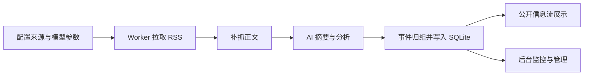

# infinitum

Infinitum 是一个基于 Next.js 16、SQLite 和后台 Worker 的资讯聚合工作台，用来完成 RSS 抓取、正文补抓、AI 摘要分析、事件归组，以及面向访客和管理员的信息流浏览与管理。

## Infinitum 是什么？

Infinitum 面向“持续跟踪信息流”这个场景，提供一条完整流水线：

- 从多个 RSS 源同步内容
- 在 RSS 缺失正文时补抓原文
- 使用 OpenAI-compatible 模型生成摘要、标题翻译和内容分析
- 将多篇报道归并为同一事件聚合组
- 在公开信息流中按时间、来源、分组和标题检索浏览
- 在后台完成抓取调度、内容治理、聚合维护和模型配置

## 核心功能

- **RSS 抓取与正文补全**：支持多源 RSS 同步，并在 RSS 内容不足时自动补抓正文。
- **AI 摘要与分析**：支持标题翻译、摘要生成、内容质量判断、事件结构化分析。
- **事件归组**：将描述同一事件的多条内容聚合为 cluster，减少信息流重复噪声。
- **公开信息流浏览**：支持按时间范围、来源、分组、标题关键词筛选，支持聚合内容与单条内容混合展示。
- **访客互动能力**：支持对聚合内容进行投票，并输出公开 RSS。
- **管理员工作台**：支持手动触发抓取、查看任务状态、过滤/恢复内容、重跑 AI、调整聚合关系、隐藏或合并聚合组。
- **后台配置中心**：支持维护信息源、来源分组、黑名单、模型 API 配置、提示词配置和抓取调度。
- **后台任务体系**：Web 负责入队，Worker 负责异步执行，支持监控、取消、重试和异常恢复。
- **Docker 部署**：提供 app/worker 双服务 Compose 配置，默认带 SQLite 持久化卷。

## 使用流程



## 快速开始

### 1. 准备环境变量

```bash
cp .env.docker.example .env.docker
```

至少需要配置：

- `DATABASE_URL`
- `ADMIN_PASSWORD`
- `ADMIN_SESSION_SECRET`

默认 Docker 环境示例：

```env
DATABASE_URL=file:/app/data/dev.db
ADMIN_PASSWORD=change-me
ADMIN_SESSION_SECRET=replace-with-a-long-random-secret
```

### 2. 启动服务

```bash
docker compose up -d --build
```

### 3. 验证状态

```bash
docker compose ps
docker compose logs -f app worker
```

默认访问地址：

- Web：[http://localhost:3001](http://localhost:3001)
- 管理员登录：[http://localhost:3001/login](http://localhost:3001/login)

## 本地开发

### 1. 安装依赖

```bash
npm install
```

### 2. 准备环境变量

```bash
cp .env.example .env
```

默认本地环境变量：

```env
DATABASE_URL="file:./prisma/dev.db"
ADMIN_PASSWORD="change-me"
ADMIN_SESSION_SECRET="replace-with-a-long-random-secret"
```

### 3. 初始化数据库

```bash
npm run prisma:generate
npm run db:setup
```

### 4. 启动 Web 和 Worker

```bash
# 终端 1
npm run dev

# 终端 2
npm run worker
```

本地默认访问地址：

- Web：[http://localhost:3000](http://localhost:3000)
- 管理后台登录：[http://localhost:3000/login](http://localhost:3000/login)

## 运行配置

首次启动会初始化，后续通过后台设置页维护：

- 信息源与来源分组
- 黑名单关键词
- 模型 API 配置
- Prompt 配置
- 抓取调度参数

默认模型配置为空时：

- 标题翻译会回退为原标题
- 摘要会回退为 RSS 摘要或正文截断
- 内容分析会回退为基础默认值

## FAQ

### 为什么我改了源码里的默认来源或提示词，线上没有变化？

因为这些默认值只在初始化阶段导入一次。系统启动并写入数据库后，后续运行以数据库中的配置为准，应通过后台设置页修改。

### 为什么手动触发抓取后没有执行？

先检查 `worker` 服务是否在运行：

```bash
docker compose ps
docker compose logs -f worker
```

Web 只负责创建任务，真正执行抓取、AI 分析和归组的是 Worker。

### 为什么调用 `/api/ingest/run` 返回 401？

这个接口要求管理员登录态。请先访问 `/login` 登录，再从页面操作或携带管理员会话调用接口。

### 为什么 Docker 启动后访问不了 `localhost:3000`？

因为默认 Compose 端口映射是 `3001:3000`，宿主机应该访问 [http://localhost:3001](http://localhost:3001)。

### 为什么后台可以打开，但信息流一直没有更新？

通常有三类原因：

- 没有可用的信息源配置
- Worker 未运行或持续异常退出
- 模型 API 未配置，导致 AI 能力回退，但这一般不会阻止基础抓取

建议先检查：

```bash
docker compose logs -f app worker
```

## 许可证

CC BY 4.0 License
